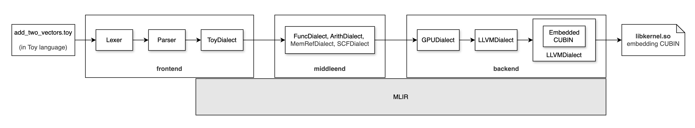
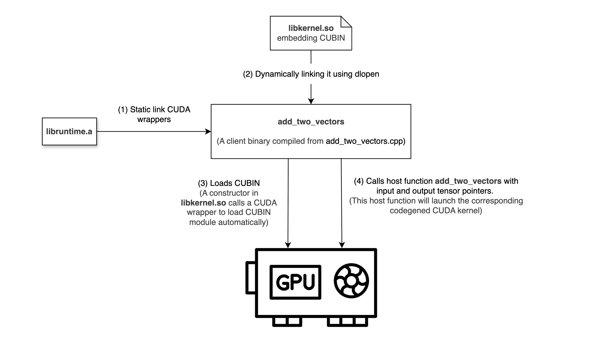

# Toy ML Compiler
Lowering Pipeline:<br/>

<br/>

Runtime:<br/>


## How to build
```Bash
git submodule update --init --recursive
make
```
Output: ./build/compiler

## Compile add_two_tensors.toy
```Bash
./compile.sh
```
Output: ./libkernel.so

## Launch generated CUDA kernel
```Bash
./test.sh
```
