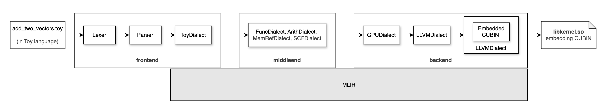
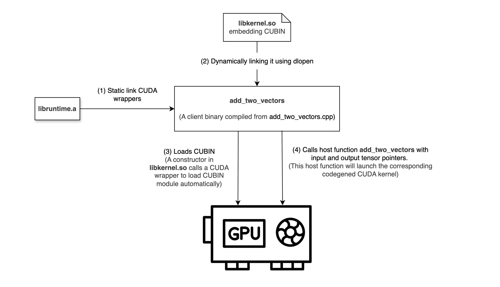

# Toy ML Compiler
This toy compiler is for learning MLIR and how to build an ML compiler from scratch. <br/>
Currently, what it can do is compile a simple [add_two_vectors](./add_two_vectors.toy) function, written in a toy DSL, into a real CUDA kernel that can be launched on an NVIDIA GPU.
<br/>

**Lowering Pipeline:**<br/>

<br/>

**Runtime:**<br/>


## How to build
**Prerequisites**<br/>
```
1. CUDA Toolkit version >= 12.4
2. CMake version >= 3.31.6
3. Clang version >= 17
```
<br/>

**Build commands**
```Bash
git submodule update --init --recursive
export CUDA_ROOT=/usr/local/cuda-12.4
make
```
Output: ./build/compiler

## Compile add_two_tensors.toy
```Bash
./compile.sh
```
Output: ./libkernel.so

## Launch generated CUDA kernel
```Bash
./test.sh
```

## Discussion Channel
If you are interested in this toy project, feel free to reach out to me on LinkedIn.<br/>
My LinkedIn: https://www.linkedin.com/in/ngocson2vn/
<br/>

# Development Notes
## Lowering GPU module to CUBIN
The backend passes generate a GPU module which is represented in both **LLVM Dialect** and **NVVM Dialect** as follows:
```MLIR
  gpu.module @add_two_vectors_kernel [#nvvm.target<chip = "sm_86", features = "+ptx84">] attributes {dlti.dl_spec = #dlti.dl_spec<index = 64 : i64>} {
    llvm.func @add_two_vectors_kernel(%arg0: i64, %arg1: !llvm.ptr, %arg2: !llvm.ptr, %arg3: !llvm.ptr) attributes {gpu.kernel, gpu.known_block_size = array<i32: 128, 1, 1>, nvvm.kernel, nvvm.maxntid = array<i32: 128, 1, 1>} {
      %0 = llvm.mlir.constant(-128 : index) : i64
      %1 = llvm.mlir.constant(128 : index) : i64
      %2 = nvvm.read.ptx.sreg.ctaid.x : i32
      %3 = llvm.sext %2 : i32 to i64
      %4 = nvvm.read.ptx.sreg.tid.x range <i32, 0, 128> : i32
      %5 = llvm.sext %4 : i32 to i64
      %6 = llvm.mul %3, %1 overflow<nsw> : i64
      %7 = llvm.mul %3, %0 overflow<nsw> : i64
      %8 = llvm.add %7, %arg0 : i64
      %9 = llvm.intr.smin(%8, %1) : (i64, i64) -> i64
      %10 = llvm.icmp "slt" %5, %9 : i64
      llvm.cond_br %10, ^bb1, ^bb2
    ^bb1:  // pred: ^bb0
      %11 = llvm.add %5, %6 : i64
      %12 = llvm.getelementptr %arg1[%11] : (!llvm.ptr, i64) -> !llvm.ptr, f32
      %13 = llvm.load %12 : !llvm.ptr -> f32
      %14 = llvm.getelementptr %arg2[%11] : (!llvm.ptr, i64) -> !llvm.ptr, f32
      %15 = llvm.load %14 : !llvm.ptr -> f32
      %16 = llvm.fadd %13, %15 : f32
      %17 = llvm.getelementptr %arg3[%11] : (!llvm.ptr, i64) -> !llvm.ptr, f32
      llvm.store %16, %17 : f32, !llvm.ptr
      llvm.br ^bb2
    ^bb2:  // 2 preds: ^bb0, ^bb1
      llvm.return
    }
  }
```
<br/>

Lowering pipeline: GPU module (**LLVM Dialect** and **NVVM Dialect**) -> LLVM IR -> PTX ISA -> CUBIN. <br/>

The following backend pass is responsible for lowering the GPU module to CUBIN:
```C++
mlir::GpuModuleToBinaryPassOptions binPassOptions;
binPassOptions.compilationTarget = "bin";
pm.addPass(mlir::createGpuModuleToBinaryPass(binPassOptions));

// llvm-project/build/tools/mlir/include/mlir/Dialect/GPU/Transforms/Passes.h.inc
template <typename DerivedT>
class GpuModuleToBinaryPassBase : public ::mlir::OperationPass<> {
private:
  friend std::unique_ptr<::mlir::Pass> createGpuModuleToBinaryPass(GpuModuleToBinaryPassOptions options) {
    return std::make_unique<DerivedT>(std::move(options));
  }

// llvm-project/mlir/lib/Dialect/GPU/Transforms/ModuleToBinary.cpp
class GpuModuleToBinaryPass
    : public impl::GpuModuleToBinaryPassBase<GpuModuleToBinaryPass> {
public:
  using Base::Base;
  void runOnOperation() final;
};

// Call Stack:
GpuModuleToBinaryPass::runOnOperation()
  -> mlir::gpu::transformGpuModulesToBinaries()
    -> moduleSerializer()
      -> NVVMTargetAttrImpl::serializeToObject()
        -> mlir::LLVM::ModuleToObject::run()
          -> NVPTXSerializer::moduleToObject()

// Key steps:
// 1. translateToLLVMIR() translates GPU module to LLVM IR
// llvm-project/mlir/lib/Target/LLVM/ModuleToObject.cpp
// std::unique_ptr<llvm::Module> llvmModule = translateToLLVMIR(llvmContext);
// 
// 2. translateToISA() translates LLVM IR to PTX ISA
// llvm-project/mlir/lib/Target/LLVM/NVVM/Target.cpp
// std::optional<std::string> serializedISA = translateToISA(llvmModule, **targetMachine);
// 
// 3. compileToBinary() compiles PTX to CUBIN
// llvm-project/mlir/lib/Target/LLVM/NVVM/Target.cpp
// result = compileToBinary(*serializedISA);
```
